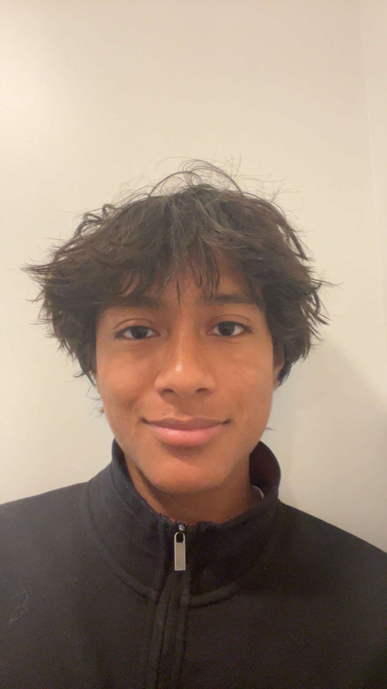

<html lang="en">
<head>
  <meta charset="UTF-8" />
  <meta name="viewport" content="width=device-width, initial-scale=1.0" />
  <title>Navin Kadel</title>
  <link href="https://fonts.googleapis.com/css2?family=EB+Garamond:ital,wght@0,400;0,500;1,400&display=swap" rel="stylesheet" />
  
</head>
<body>

  <!-- Replace src with your actual photo path, e.g. src="photo.jpg" -->
  

  
Neurobiology, UC San Diego &middot; D1 Athlete

  

    I am a first-year undergraduate studying neurobiology at UC San Diego.  Interested in translational neuroscience and running fast.
  

  <section>
    <h2>Academics</h2>
    

    relevant courses: human physiology, linear algebra, probability & statistics, calculus, chemistry 
    cum. gpa: 4.0
      
    

  </section>
  

  <section>
    <h2>Athletics</h2>
    <ul>
    <li>2024 CIF XC State Champion</li>
      <li>#18 California Senior in the mile</li>
      <li>NCAA Division 1 Cross Country, Track & Field Athlete</li>
      <li>Big West Conference Qualifier</li>
      
    </ul>
  </section>

  <section>
    <h2>Collaborate & Contact</h2>
      

    I am open to connect if you find anything here interesting
  

    

      <a href="mailto:nkadel@ucsd.edu">nkadel@ucsd.edu</a>
      <a href="https://www.linkedin.com/in/navin-kadel-85a897292/" target="_blank">LinkedIn</a>
      <a href="https://www.instagram.com/navin.kadel" target="_blank">Instagram</a>
    

  </section>

</body>
</html>
