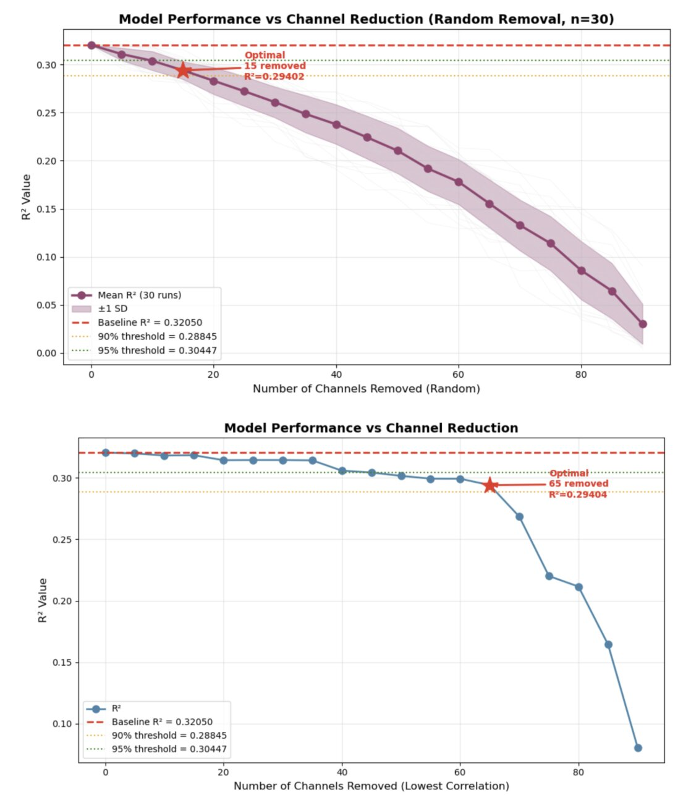
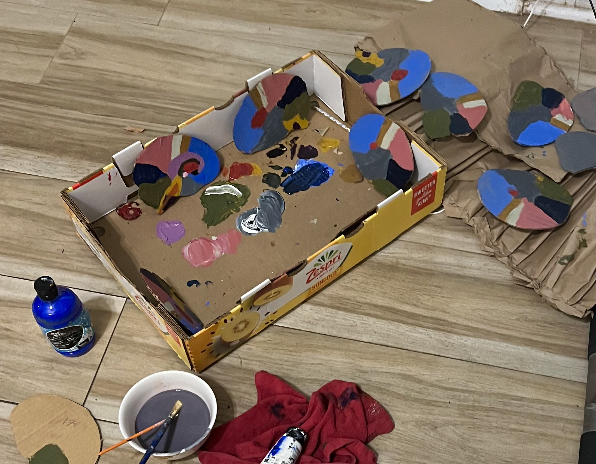
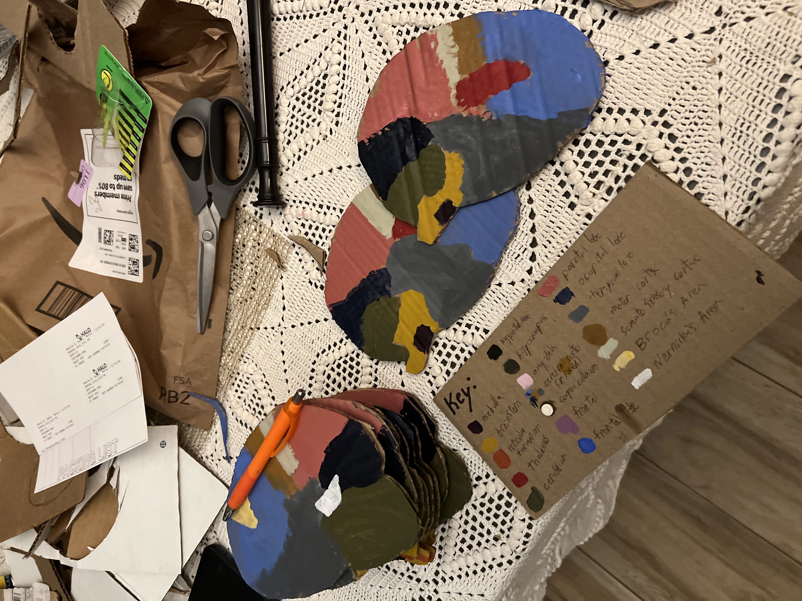

<html lang="en">
<head>
  <meta charset="UTF-8" />
  <meta name="viewport" content="width=device-width, initial-scale=1.0" />
  <title>Navin Kadel</title>
  <link href="https://fonts.googleapis.com/css2?family=EB+Garamond:ital,wght@0,400;0,500;1,400&display=swap" rel="stylesheet" />
  
</head>
<body>

  

  

    I am a first-year neurobiology undergraduate at UC San Diego interested in translational neuroscience.
  

  

    <a href="mailto:nkadel@ucsd.edu">email</a>
    /
    <a href="https://www.linkedin.com/in/navin-kadel-85a897292/" target="_blank">linkedin</a>
    /
    <a href="cv.pdf" target="_blank" rel="noopener noreferrer">cv</a>
  

  <nav>
    <button class="active" onclick="showTab(event, 'academics')">academics</button>
    <button onclick="showTab(event, 'athletics')">athletics</button>
    <button onclick="showTab(event, 'projects')">projects</button>
    <button onclick="showTab(event, 'misc')">misc</button>
  </nav>

  

    
relevant courses: human physiology, linear algebra, probability &amp; statistics, calculus, general chemistry

    
cumulative gpa: 4.0

  

  

    <ul>
      <li>NCAA Division 1 Cross Country, Track &amp; Field Athlete</li>
      <li>Top 20 California Senior in the mile (4:11)</li>
      <li>CIF XC State Champion</li>
    </ul>
  

  

    

      I competed in a brain computer interface hackathon and worked in a team of four doing data science/statistical tests. The dataset we chose was a linear prediction of simultaneous and independent movements of two finger groups using an intracortical brain-machine interface (Utah Array), which is basically predicting the way a rhesus macaque would move its fingers based only on neuron spiking. Our project specifically focused on reducing neural dimensionality by selectively removing low-correlation channels while maintaining decoder performance (measured by R², the proportion of variance in finger velocity explained by spiking activity in our regression model).

    
  

  

    
Inspired by 2D cross-sectioning that MRI machines do, I thought it would be interesting to create a 3D structure of basic neuroanatomy using a similar method. I cut out 12 uniquely shaped cardboard slices and painted both sides of each with their corresponding brain region, then connected the slices with three 1x1 lego studs hot-glued to each side.

    
    
  

  

</body>
</html>
